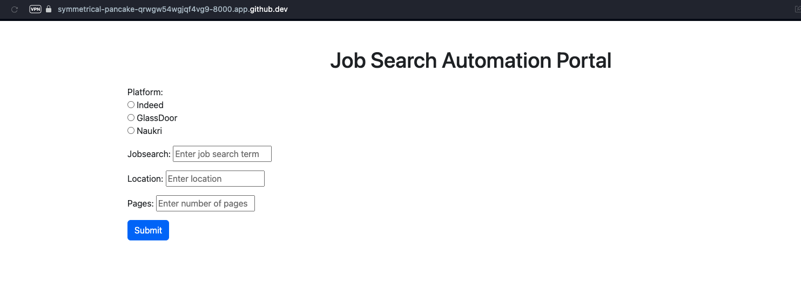
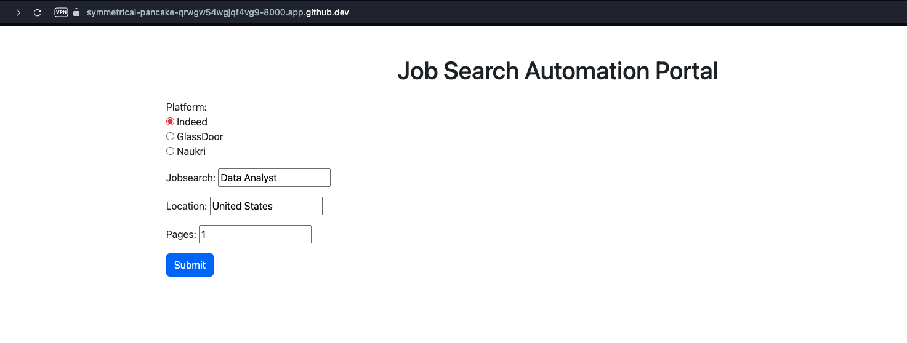
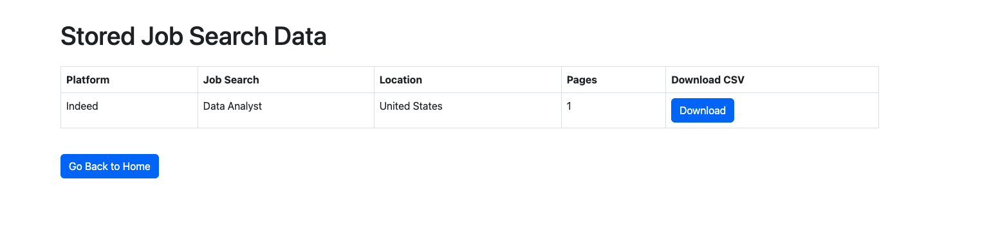

# Job Search Automation

Purpose: This repository is designed to help recent graduates and undergraduates automate job searches, saving valuable time and effort. It is actively maintained, with regular updates to include new variables and additional job sites.

Contributions and feedback are welcome! Please feel free to fork or clone this repository, and raise any issues or suggestions directly on GitHub.

## Getting Started with GitHub Codespaces

Follow these steps to set up and run the project in your GitHub Codespace environment.

### Step 1: Create a Virtual Environment

``` bash
virtualenv ~/.venv
source ~/.venv/bin/activate
```

### Step 2: Install Python Dependencies

Install all required Python packages:

``` bash
make install
```

### Step 3: Install System Dependencies

Update your package list and install system requirements:

``` bash
sudo apt-get update
sudo apt-get install chromium-browser
sudo apt-get install chromium-chromedriver
```

### Step 4: Verify Code Functionality

Run the following command to check code correctness:

``` bash
make all
```

### Step 5: Making Django models ready

Run the following command to get ready the Django Models:

``` bash
python WebApp/manage.py makemigrations
python WebApp/manage.py migrate
```

### Step 5: Run the Main Script

Run the script to start browser and start browsing it:

``` bash
python main.py
```

## Customizing the Job Search 

Follow the below screenshots and get the required data into your desktop

{fig-align="center"}

{fig-align="left" width="476"} {fig-align="right" width="476" height="170"}

{fig-align="center"}